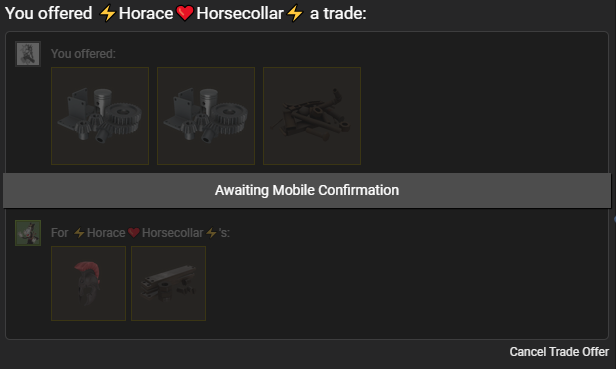

# Instant Trade Offer for Backpack.tf

This browser extension (powered by [Tampermonkey](https://www.tampermonkey.net/)) that adds a button to backpack.tf listings, which will instantly send your offer as specified by the listing.

# This is a Fork

This is a fork of One-Click Offer, props to the founder. I will continue to work on this plugin and if you have any ideas for the plugin, I will be happy to review them in the issues. 

### Features

- Adds a button that sends the offer for you.
- Supports both [Classic](https://backpack.tf) and [Next](https://next.backpack.tf) backpack.tf.
- Supports practically every buy and sell order, including those that don't contain the trade offer button.
- Makes use of change.
- Rounds the price to the nearest 0.11, 0.22 etc. (Got inspired by the [Hav's fork](https://github.com/HavishH/backpack-offer-sender))
- Avoids reusing the same items by looking into the trade offer history.

### Installation

- Install [Tampermonkey](https://www.tampermonkey.net/)
- [Open the script](https://github.com/EurekaEffect/instant-trade-offer/raw/main/offer_sender.user.js)
- Click Install

### Usage

- Simply find the light-purple button on the listing

- Click (The Pros use middle click)

- Wow!

### Disclaimer

The script is well tested and consistently produces correct results.
However, there may be some situations in which the script receives bad information, and produces unexpected results.
This may happen after updates to the backpack.tf or steamcommunity.com websites, or if another extension interferes with this one.

Therefore, make sure to <ins>always double check the offer</ins> before confirming it.

---

Greasemonkey is not supported for now. However, the [Tampermonkey](https://www.tampermonkey.net/) plugin for Firefox does work.

---

### License

MIT
